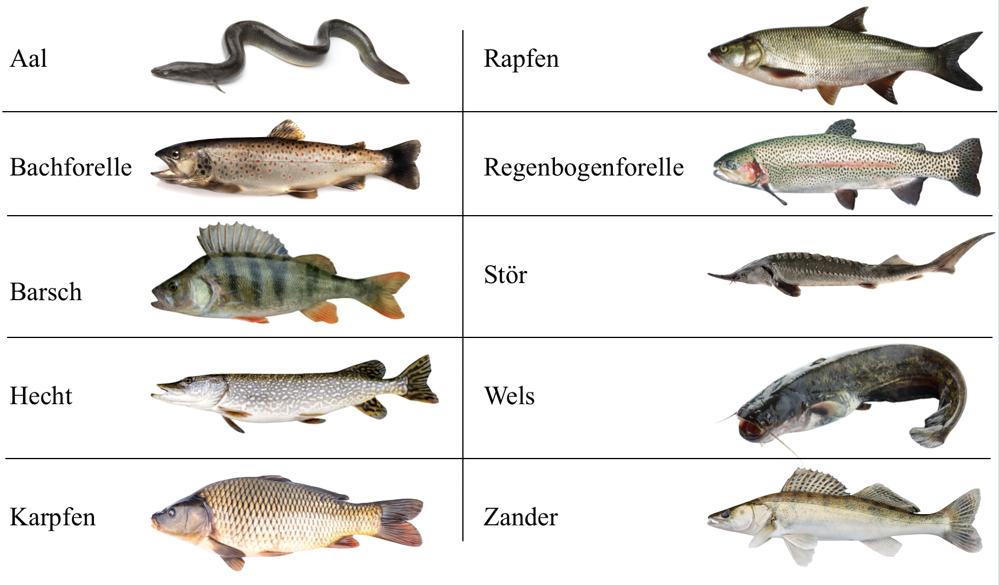

# Machine-Learning-Fish-Detection
This is an iOS prototype to determine regional fish species on images. 🎣 🎣 🎣 🎣

<br>

# How does it work?

The model was trained with the help of Tensorflow. For this purpose, 10 different species of fish were examined and trained on the MobileNet_v1_1.0_224 model. Altogether 2000 different images could be compiled, which were evenly distributed on the 10 fish species. <br>

The aim was to find fish pairings, which have certain similarities due to their color, shape and fin combinations. With the help of a confusion matrix, it should be found out how much, and especially which types of fish are wrongly predicted, in order to gain further insights.

## Fish species

This model can differentiate between 10 different fish species: <br>

<br>

## Confusion matrix

<br>

## Install the App
Download the App by cloning the repository or download the zip file.<br>
Open up the terminal and go to the root of the folder.

```
cd path/to/bei_fisch_frag_chrisch_version1.6
```

Make sure that you have [Homebrew](https://brew.sh/index_de) and [Carthage](https://github.com/Carthage/Carthage) installed.

### Install Homebrew
```
/usr/bin/ruby -e "$(curl -fsSL https://raw.githubusercontent.com/Homebrew/install/master/install)"
```

### Install and Update Carthage
```
brew install carthage
carthage update
```
If it was successful, it should look like this:

<br>

### Issues 

It can happen, that Xcode is complaining about finding neccessary libraries. Therefore go to the Carthage folder and add
**CropViewController.framework** and **PaperOnboarding.framework** to **Linked Frameworks and Libraries** via drag and drop. This should look like this in the end:
  
<br>

This prottotype was made with the help of 2 libraries:
  1. [TOCropViewController](https://github.com/TimOliver/TOCropViewController)
  2. [PaperOnboarding](https://github.com/Ramotion/paper-onboarding)
